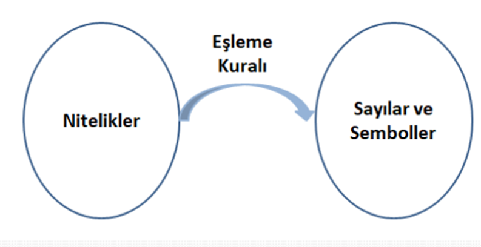
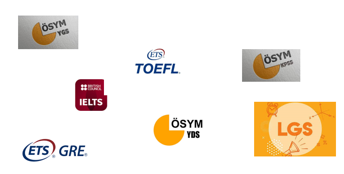

```{r child = "../setup.Rmd"}
```

```{r set-theme, include=FALSE}
library(xaringanthemer)
style_duo_accent(
  primary_color      = "#0F4C81", # pantone classic blue
  secondary_color    = "#B6CADA", # pantone baby blue
  header_font_google = google_font("Raleway"),
  text_font_google   = google_font("Raleway", "300", "300i"),
  code_font_google   = google_font("Source Code Pro"),
  text_font_size     = "30px"
)
```

```{r, include=FALSE}
advdate <- function(obj, adv) {
 tmon <- obj + 7*(adv-1)
 # tfri <- obj + 4 + 7*(adv-1)
 tmon <- format(tmon, format="%d/%m")
 # tfri <- format(tfri, format="%d/%m")
 zadv <- sprintf("%02d", adv)
 tmp <- paste("Hafta ",zadv,sep='',", ", tmon)
 return(tmp)
}

library(lubridate)
options(scipen=999)
library(tidyverse)
library(stevemisc)
mon <- ymd(20220210)
```

---
# Eğitim Nedir?

-   Eğitim; "bireyin davranışında kendi yaşantısı yoluyla ve kasıtlı olarak istendik değişme meydana getirme sürecidir" (Ertürk,1975:12).

```{r echo=FALSE, fig.align='center',out.width="60%"}

```

---
# Ölçme Nedir?

-   Hayatın her alanında olduğu gibi **eğitim** alanında da, işin neresinde olduğumuzu, ulaştığımız sonuçları, başarılı olup olamadığımızı görmek ve bundan bir karar çıkarmak zorundayız.

-   Eğitim öğretim açısından da öğrenciye kazandırmayı kararlaştırdığımız bilgi, beceri, tutum, tavır, davranış vb. gibi özellikleri, öğrencinin kazanıp kazanamadığını görmek ve çalışmalarımızı ona göre planlamak durumundayız.

---
## Ölçme Nedir?

-   Eğitim bir sistem olarak düşünüldüğünde, bu sistemin başarılı ve başarısız olduğu yanların belirlenmesi ve başarısızlık kaynaklarının belirlenmesi önemlidir.

-   Öğrenci davranışlarındaki değişiklik uygulanan öğretimin başarısına, öğrenciden beklenen davranış değişikliğinin gerçekleşmemesi de uygulanan eğitimin başarısızlığına kanıttır.

---
## Ölçme Nedir?

```{r echo=FALSE, fig.align='center',out.width="60%"}

```

---
## Ölçme Nedir?

-   En son ne zaman ölçme yaptınız?

-   Sabah tartıldınız mı?

-   Bugünkü hava sıcaklığını öğrenmek için termometreye baktınız mı?

---
## Ölçme Nedir?

-   Eğitimde öğrenci davranışlarını ölçmeden bir yargıya varmak mümkün değildir.

-   Ölçme yapmak için de bir ölçme aracı geliştirmemiz ya da geliştirilen bir ölçme aracını kullanmamız gerekir.

-   Bu bakımdan yapılan ölçme sonucunda elde edilen verilere bakarak ve ölçme sonuçlarını önceden kararlaştırdığımız bir takım ölçütlerle karşılaştırarak değerlendirmeler yapabilir duruma gelebiliriz.

-   Eğitim bir bilimdir ve eğitim sonucu kazandırılan özelliklerin ölçülebilmesi gerekir.

---
## Ölçme Nedir?

-   Ölçme; insanın varlığı ile var olan ve var olmaya devam edecek olan bir kavramdır. Çünkü insanoğlunun her nasıl var olduğu kabul edilirse edilsin, var olduğu ilk andan itibaren çevresinde olan varlıkları gözlemlemek, algılamak ve buna göre tepkide bulunmak gibi bir mecburiyeti olmuştur.

-   Bu gözlemleme ve algılama işi de başlı başına bir ölçmedir. Bu sebeple ölçme kavramı insanın varlığı ile başlamakta ve hâlâ bu kavram insanla birlikte devam etmektedir.

-   Günümüzde ise ölçülemeyen şeyin bilimi yoktur yargısından sonra insanı ölçmeden ayrı düşünmek mümkün görünmemektedir.

---
## Ölçme Nedir?

-   Her bilim dalının kendine özgü özel terimleri ve bu terimlerin o bilim dalına özgü anlamları vardır.

-   İlgili bilim dalı kendine ait terimleri, kavramları, özel bilgileri ile diğer bilim dalından ayrılır. Bir kelimenin günlük dildeki anlamı ile yan anlamı, bir bilim dalındaki anlamı ve diğer bilim dalındaki anlamı farklılık gösterebilmektedir.

-   Bilim dalının oluşmasında o bilim dalına özgü terimlerin ve kuramların önemli bir payı vardır.

---
## Ölçme Nedir?

-   Ölçmenin farklı bilim dallarında farklı tanımlarını görmek mümkündür.

-   Fakat, aynı zamanda aynı bilim dalı içinde de farklı ölçme tanımları görülebilmektedir.

-   Ölçmenin mantığı bir ölçme aracı oluşturmak için gerekli olan şartlarla ilgilidir.

-   Ölçme, burada kullanıldığı şekli ile, karşılaştırma standardının geliştirildiği sürece atfedilir.

---
## Ölçme Nedir?

-   Geniş anlamı ile ölçme, herhangi bir niteliğin gözlenmesi ve gözlem sonucunun sayılarla ya da başka sembollerle ifade edilmesidir.

```{r echo=FALSE, fig.align='center',out.width="60%"}

```


`Ölçmenin konusu, objelerin kendileri değil onların dikkate alınan özellikleridir.`

---
# Eğitimde Ölçme

Ölçme ve değerlendirme, öğretimi tamamlayan bir süreçtir. Bir öğretim programı etkili bir öğretim hizmeti ile uygulanırken bir yandan da uygulamanın her adımında gerçekleşen ürünlerin incelenmesi, öğretme-öğrenme sürecinin istenen ürünleri verip vermediğinin izlenmesi gerekir (Özer Özkan, 2019).

---
## Dunden Bugune

-   MÖ 2200 yıllarında Çin'de devlet memurlarının işe alınmasında yarışmaya dayalı karmaşık denilebilecek bir seçme sisteminin uygulanması,

-   MÖ 1115 yılında Çin İmparatoru Chang tarafından devlet hizmeti sınavları haline getirilmesi ve 1905 yılına kadar devame etmesi,

-   Müzik, at yetiştiriciliği ve biniciliği, aritmetik, askerlik, okçuluk, ziraat, yazma, coğrafya, din, hükümetle ilgili hesaplama işlemleri konuları içerirdi,

---
## Dunden Bugune

-   Bugünkü ölçme ve değerlendirme sistemlerinin kökleri

-   Puanlama güvenirliğine önem verilmesi ve gerekli önlemlerin alınması.

-   1800'lü yılların sonuna kadar pek çok yönden Avrupa ve Amerika'ya model olmuştur.

---
## Dunden Bugune

```{r echo=FALSE, fig.align='center',out.width="60%"}

```


---
## KAYNAKLAR

-   Ertürk, S. (1975). Eğitimde Program Geliştirme. Ankara Yelken Yayınları

-   Özer Özkan, Y. (2019). Ölçme ve Değerlendirme İle İlgili Temel Kavramlar. Çetin, B. (Edt.) Eğitimde Ölçme ve Değerlendirme içinde (1-22). Anı Yayıncılık.

-   Turgut, M. F. ve Baykul, Y. (2019). Eğitimde Ölçme ve Değerlendirme. PegemA Yayıncılık.

---
# Ödev -II

Ödevinizi moodle üzerinde bulabilirsiniz.
<!-- -   Ödev - I (+) -->

<!-- -   [Künyesi aşağıda bulunan makaleyi ders öncesinde okuyunuz.](https://drive.google.com/file/d/11rgnn9lSEmckexq7jOxzi_LiIn6VSRrU/view?usp=sharing) -->

<!-- -   Baykul, Y. (2011). Ülkemizde Ölçme ve Değerlendirmenin Dünü -- Bugünü ve Yarını. Eğitimde ve Psikolojide Ölçme ve Değerlendirme Dergisi, 2. -->

