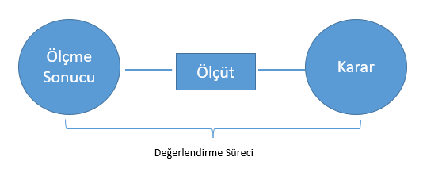
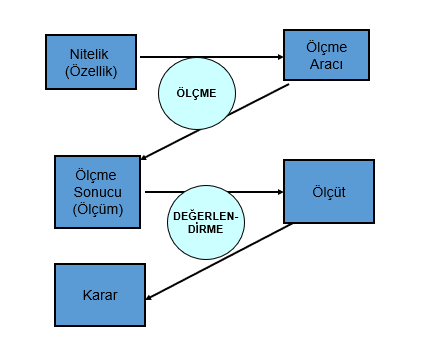
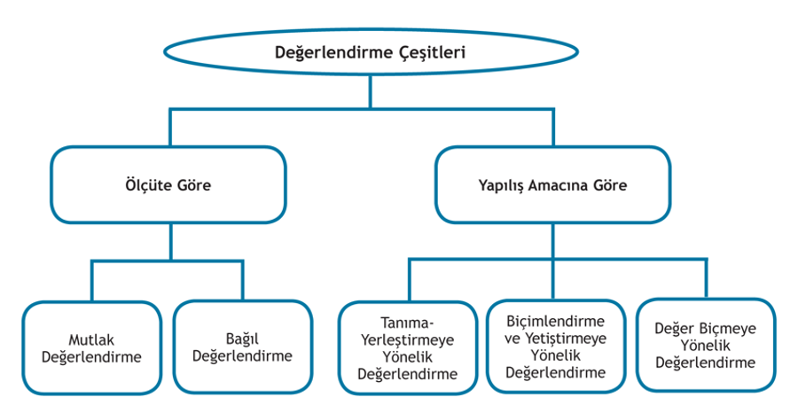
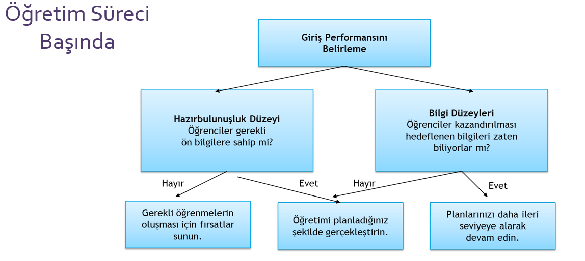
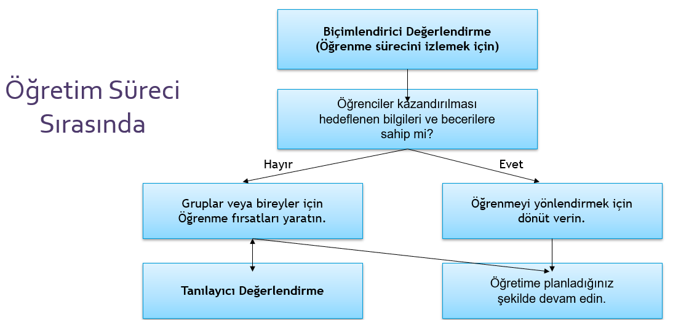

```{r child = "../setup.Rmd"}
```

```{r set-theme, include=FALSE}
library(xaringanthemer)
style_duo_accent(
  primary_color      = "#0F4C81", # pantone classic blue
  secondary_color    = "#B6CADA", # pantone baby blue
  header_font_google = google_font("Raleway"),
  text_font_google   = google_font("Raleway", "300", "300i"),
  code_font_google   = google_font("Source Code Pro"),
  text_font_size     = "30px"
)
```

```{r, include=FALSE}
advdate <- function(obj, adv) {
 tmon <- obj + 7*(adv-1)
 # tfri <- obj + 4 + 7*(adv-1)
 tmon <- format(tmon, format="%d/%m")
 # tfri <- format(tfri, format="%d/%m")
 zadv <- sprintf("%02d", adv)
 tmp <- paste("Hafta ",zadv,sep='',", ", tmon)
 return(tmp)
}

library(lubridate)
options(scipen=999)
library(tidyverse)
library(stevemisc)
mon <- ymd(20220207)
```

# Değerlendirme.huge[`r emo::ji("stats")`]

.hand[İçerik...]

-   
-   

---
##Değerlendirme.huge

```{r echo=FALSE, fig.align='center',out.width="60%"}

```


**Ölçme sonuç**larını bir **ölçüt**e veya ölçütlere karşılaştırarak ölçülen nitelik hakkında bir **değer yargısına (karara)** varma sürecidir (Turgut ve Baykul, 2019).

---
## Ölçme ve Değerlendirme

```{r echo=FALSE, fig.align='center',out.width="60%"}

```

---
## Değerlendirme

-   Ayşe'nin YDS Puanı: 76

-   Yüksek lisansa kabul için gerekli olan alt sınır: 70

    -   $76>=70$

-   Ayşe yüksek lisans için gerekli dil koşulunu sağlar.

---
## Değerlendirme

-   Mert'in matematik puanı: 76

-   Başarılı olmak için gerekli olan alt sınır: Sınıf ortalaması

-   Sınıf ortalaması=85

    -   $76<85$

-   Mert matematik dersinden başarısız olmuştur.

---
# Ölçüt

-   Ölçüt elde edilen **ölçme sonuçlarına göre** ölçülen özellik ya da özellikler bakımından birey ya da nesneler hakkında **karara** varmak için belirlenen r**eferans ya da eşik noktası/noktaları**dır.

-   Ölçütün amaçla uyumlu olması **önemlidir**.

---
## Değerlendirme

**Örnek Durum:** Öğretmen ilköğretim 3 sınıfa başlayan öğrencilere 3 basamaklı iki sayıyı doğru olarak toplama ve çıkarma becerisini kazandırmak istiyor.

-   Öğretim hedefi belirlenir.

-   Giriş davranışları / Hazır bulunuşluk düzeyi belirlenir.

-   Sonuca bağlı olarak uygun öğretim stratejisi seçilir.

---
## Değerlendirme

Değerlendirmede doğru değer yargısına ulaşmak kolay **değildir**.

Doğru ve kullanışlı bir değer yargısına ulaşmak ancak şu koşullara bağlıdır:

-   Ölçme sonuçları **geçerli** (ölçme amacına hizmet etme) olmalıdır.

-   Ölçme sonuçları **güvenilir** (hatalardan arınıklık) olmalıdır.

-   Değerlendirme geçerli ve **amaca uygun bir ölçüte** dayanmalıdır.

-   Değerlendirme işlemleri hatasızca yapılabilmelidir.

-   Değerlendirme, ilgilendiğimiz eğitim kararı için kullanışlı bir değer yargısı vermelidir.

---
# Değerlendirme ve Türleri

-   Öğretim programının değerlendirilmesi

-   Öğretim etkililiğinin değerlendirilmesi

-   Öğrenme eksikliklerinin saptanması

-   Öğrencilerin yetenek ve ilgilerine göre uygun alanlara yöneltilmesi

-   Öğrenci başarısının değerlendirilmesi

-   Değerlendirme araçlarının ve ölçütün değerlendirilmesi

---
## Değerlendirme ve Türleri

```{r echo=FALSE, fig.align='center',out.width="60%"}

```
---

## Ölçme ve Değerlendirme


| **OLCME**          | **DEGERLENDİRME** |                               
|---|---|                                                   
|Gözlem sonuçlarının sayı ve sembollerle belirtilmesidir. | Ölçme sonuçlarının ölçütle karşılaştırılarak ölçülen nitelik hakkında bir yargıya varılması sürecidir. |
|  Betimleme işidir.  | Yargılama işidir.   |
|  Ölçülen özelliğin miktarı belirlenir.    |   Ölçülen özelliğin miktarının yeterli olup olmadığı amaca uygun olup olmadığı belirlenir.  |
|  Değerlendirmeden önce yapılır.           |  Ölçmeden sonra yapılır.                  |

---
## Ölçme ve Değerlendirme

| **OLCME**                     | **DEGERLENDİRME**                            |
|---|---|
| Daha çok gözleme dayanır. |   Karşılaştırma, yorum ve yargıya dayanır. |
|                           |   Daha çok kişisel kararlara dayanır.      |
| Ölçme daha objektiftir.   |   Bu nedenle subjektiftir.                 |
| Bir ölçüt gerektirmez.    |   Bir ölçme sonucu ile ölçüt gerektirir.   |

---
## Değerlendirme ve Türleri

-   Bağıl ve Mutlak ölçüt arasındaki farkları nasıl özetleyebiliriz?

-   Hangi durumda bağıl, hangi durum da mutlak değerlendirme kullanılmalıdır?


---
## Değerlendirme ve Türleri

| **Mutlak Değerlendirme**  | **Bağıl Değerlendirme**      |
|---|---|
| Bilgi alışverişi, yardımlaşmak daha yaygındır. |Bağıl değerlendirmenin yapıldığı sınıf ortamları öğrencileri daha çok çalışmaya sevk eder.|
| 'Her koyun kendi bacağından asılır.' deyimi bu değerlendirme için uygundur. | Bu tür değerlendirmelerin yapılması rekabeti arttırır.|
|     |Öğrenciler arası dayanışmanın azalmasına neden olur. |

                                    `(Güler, 2011)`                                                                                             

---
## Değerlendirme ve Türleri

| Mutlak Ölçüt                                                               | Bağıl Ölçüt                                                        |
|---|---|
| Matematik dersinden 70 ve üzeri alan öğrenciler başarılı sayılacaktır. | Matematik dersinden ortalamanın üstünde olanlar başarılı olacaktır.   |
| Boyu 1.80 ve üzeri olanlar basketbol takımına seçilecektir. | Sınıfta en uzun boylu üç öğrenci basketbol takımına seçilecektir.    |
| Sınavda soruların %50'sini cevaplayanlar dersten geçecektir. | Sınavda sınıf ortalamasının üzerinde soru cevaplayanlar geçerli not alacaktır. |
|400 metreyi 10 saniyede koşan kişi/lere madalya verilecektir. | 400 metreyi en hızlı koşan kişiye madalya verilecektir.                        |

    `(Özer Özkan, 2019)`                                                          

---
## Değerlendirme ve Türleri

**Aşağıda verilen ölçütlere göre yapılacak değerlendirme türü bağıl mıdır, mutlak mıdır?**

-   Sınavdan 50 puan ve üstü alanlar başarılı olur.
--

-   Programın hedeflerinin %60'ini gerçekleştiren başarılı olur.
--

-   Ortalamadan yüksek puan alan başarılı olur.
--

-   Yabancı dil sınavından 70 ve üstü puan alanlar Yüksek lisans programına alınır.

--

-   Okulda ilk %10'luk dilime giren öğrencilere burs verilir. Sınıftaki en başarılı öğrenciye ödül verilir.

---
## Değerlendirme ve Türleri


|  **Ölçme** |  **Ölçüt**  |  **Değerlendirme**  |
|---|---|---|
| Emre'nin boyu 178 cm.'dir.   | Boyu 180 cm´den uzun olanlar okulun basket takımına girebilir.   | Emre okulun basket takımına giremez     |
| 85 puanın üzerinde alanlar biyoloji öğretmeni olarak atanabilir. | Erdem KPSS'den 92 puan almıştır.   | Erdem biyoloji öğretmeni olarak atanabilir.  |
| 80-89 arasındaki puanlar B seviyesi olarak kabul edilir.   | Ebru YDS'den 86 puan almıştır.  | Ebru dil tazminatı olarak ayda 50 TL alacaktır.   |


---
# Amacına Göre Değerlendirme Türleri

**Tanıma -- Yerleştirmeye Dönük Değerlendirme**

-   Eğitim sürecinin başında yapılır,

-   Amaç : Öğrenciyi tanımak, uygun programa yerleştirmek,

-   Hazırbulunuşluk düzeyi belirlenir,

-   Asıl amaç öğrenciye [not vermek değildir],

-   Seviye tespit sınavları, muafiyet sınavları vb.


`(Güler, 2011)`

---
## Amacına Göre Değerlendirme Türleri

**Biçimlendirme ve Yetiştirmeye Dönük Değerlendirme (Formatif Değ.)**

-   Eğitim süreci devam ederken yapılır,

-   Amaç: Eksiklerin belirlenmesi, hataları belirlemek, öğrenciye geri bildirimde bulunmak

-   Asıl amaç öğrenciye **not vermek değildir.**

-   Kısa sınavlar, ünite testleri, tarama testleri

    `(Güler, 2011)`

---
## Amacına Göre Değerlendirme Türleri

**Değer Biçmeye Dönük Değerlendirme (Summatif Değ.)**

-   Eğitim sürecinin sonunda yapılır,

-   Amac: Öğrencinin eğitim sonunda seviyesini belirlemek,

-   Asıl amaç not vermektir, çünkü hedeflenen eğitim süreci sona ermiştir,

-   Bitirme sınavları, uzmanlık sınavları, sertifika sınavları, finaller vb.

    `(Güler, 2011)`

---
## Amacına Göre Değerlendirme Türleri

```{r echo=FALSE, fig.align='center',out.width="60%"}

```

---
## Amacına Göre Değerlendirme Türleri

```{r echo=FALSE, fig.align='center',out.width="60%"}

```

---
## Amacına Göre Değerlendirme Türleri

```{r echo=FALSE, fig.align='center',out.width="60%"}

```

---
# Geleneksel ve Tamamlayıcı Değerlendirme

| Geleneksel                                                        | Tamamlayıcı                                               |
|-------------------------------------------------------------------|-----------------------------------------------------------|
| Öğretmen değerlendirme sürecini yapar.                            | Öğrenci değerlendirme sürecine katılır.                   |
| Değerlendirmede öğrenci aktif değildir ve sorumluluk verilmez.    | Öğrenci aktiftir, sorumluluk verilir.                     |
| Değerlendirmeler öğrenme sürecinden bağımsız olarak yapılır.      | Öğrenme ve değerlendirme süreci bir bütün olarak görülür. |

`(Doğan,2019)`

---
## **Kaynaklar**

-   Doğan, N. (2019). Temel Kavramlar. Doğan, N. (Edt.) Eğitimde Ölçme ve Değerlendirme içinde (2-28). Pegem Akademi
-   Frankel, J. R.; Wallen, N. E. & Hyun, H. H. (2012). How to Design and Evaluate Research in Education (8th Edition). New York: McGraw Hill International.
-   Güler, N. (2011). Eğitimde Ölçme ve Değerlendirme. Pegem Akademi.
-   Özer Özkan, Y. (2019). Ölçme ve Değerlendirme İle İlgili Temel Kavramlar. Çetin, B. (Edt.) Eğitimde Ölçme ve Değerlendirme içinde (1-22). Anı Yayıncılık.
-   Turgut, M. F. ve Baykul, Y. (2019). Eğitimde Ölçme ve Değerlendirme. Pegem Akademi.
