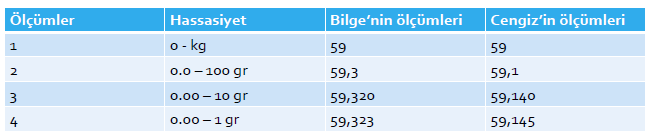
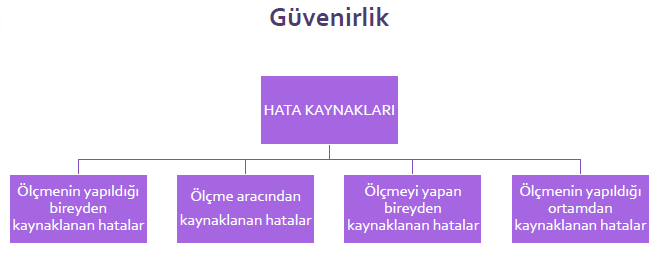
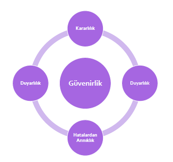
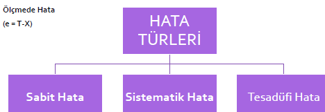
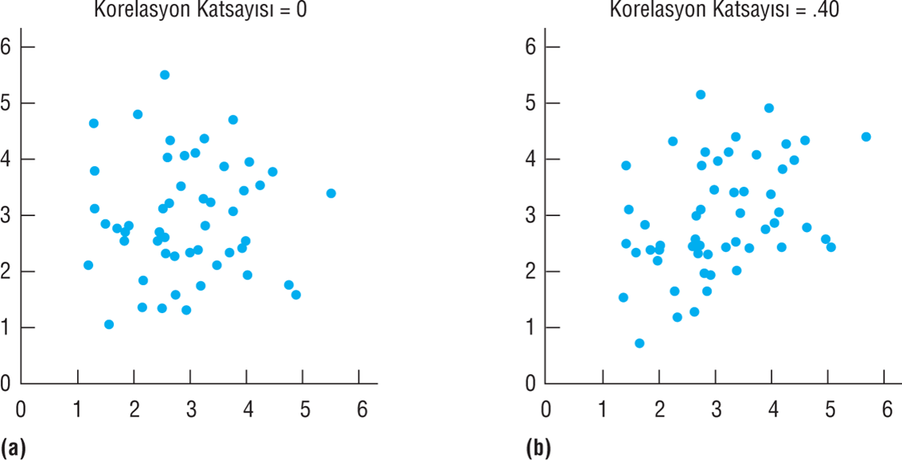
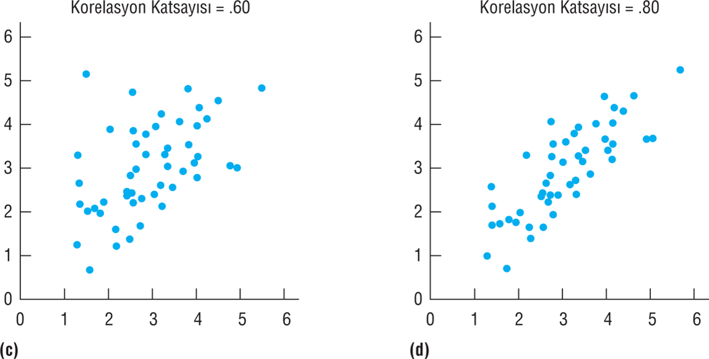
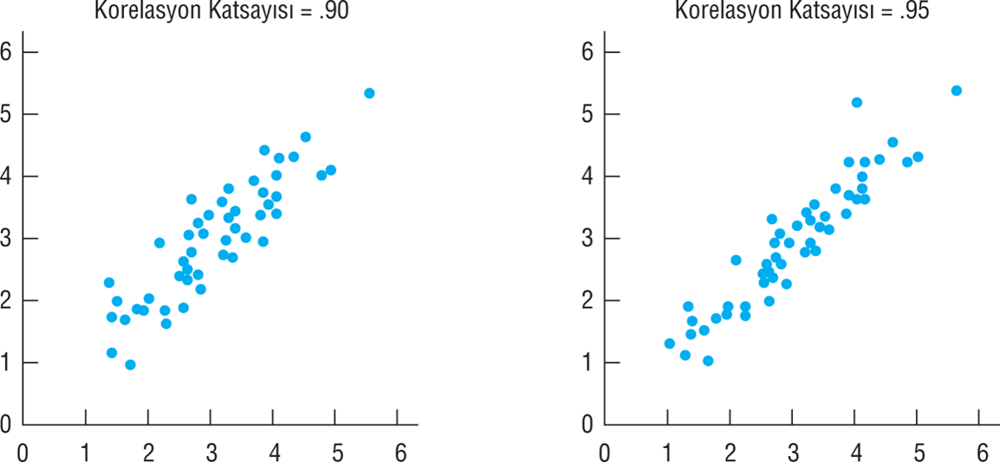
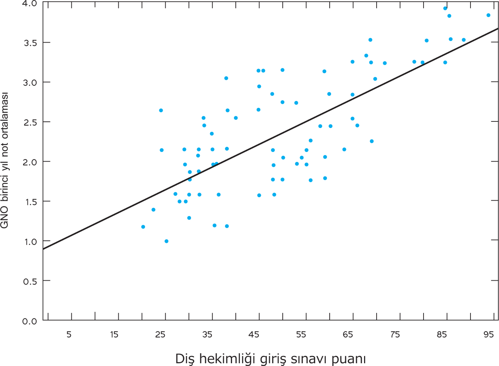

```{r child = "../setup.Rmd"}
```

```{r set-theme, include=FALSE}
library(xaringanthemer)
style_duo_accent(
  primary_color      = "#0F4C81", # pantone classic blue
  secondary_color    = "#B6CADA", # pantone baby blue
  header_font_google = google_font("Raleway"),
  text_font_google   = google_font("Raleway", "300", "300i"),
  code_font_google   = google_font("Source Code Pro"),
  text_font_size     = "30px"
)
```

```{r, include=FALSE}
advdate <- function(obj, adv) {
 tmon <- obj + 7*(adv-1)
 # tfri <- obj + 4 + 7*(adv-1)
 tmon <- format(tmon, format="%d/%m")
 # tfri <- format(tfri, format="%d/%m")
 zadv <- sprintf("%02d", adv)
 tmp <- paste("Hafta ",zadv,sep='',", ", tmon)
 return(tmp)
}

library(lubridate)
options(scipen=999)
library(tidyverse)
library(stevemisc)
mon <- ymd(20220207)
```

---
# Ölçmede Hata ve Korelasyon .huge[`r emo::ji("stats")`]

.hand[İçerik...]

-   
-   

---

## Olcme Araçlarında Aranan Ozellikler

-   Güvenirlik
-   Geçerlik
-   Kullanışlık

Güvenirlik ve geçerlik kavramlarının temel mantığı ölçme sonuçları ve bu sonuçlar kullanılarak yapılan değerlendirmelerin **ne kadar az hatalı** olduğunun belirlenmesi üzerinde kurulmuştur (Nunnally ve Bernstein, 1994; akt: Başokçu, 2019).

---
# Ölçmede Hata


```{r echo=FALSE, fig.align='center',out.width="60%"}

```


---
## Ölçmede Hata

-   Ölçülen özelliğin gerçek değeri ile gözlenen değeri arasındaki fark hatadır.

-   Bir test veya ölçekten elde edilen puanlar ne zamanhatalıdır hatalıdır?

    -   Hemen her zaman!

-   Gerek fiziksel bilimlerde gerekse sosyal bilimlerde ölçüm sonuçlarına mutlaka bir miktar hata karışır ve bu hatanın miktarı kesin olarak bilinemez.

-   Eğitim ve psikolojide ölçülen özelliklerin doğası gereği hata olasılığı daha yüksektir.

-   Hatayı ortadan kaldırmak mümkün olmasa da hata kaynaklarını belirleyip en aza indirmek mümkün olabilir.

---
## Ölçmede Hata

-   Ölçmeye karışan çeşitli hatalar nedeniyle gözlenen bir özelliğin gerçek değeri doğrudan elde edilemez, ölçme sonucu gözlenen puanlar yardımıyla kestirilmeye çalışılır.
-   Hatanın miktarı arttıkça elde edilen puan bireyin gerçek puanından (gerçek başarı, yetenek veya bilgi düzeyi) uzaklaşır.

---
## Ölçmede Hata

-   Elde edilen puanın yönü iki taraflı olabilir yani olması gerekenden fazla veya az olabilir.

-   Hataya sebep olan etkenlerin farkında olmak, ölçme işlemine karışan hataları azaltmaya yardımcı olur.

-   Ölçümlerdeki hatanın mümkün olduğunca azaltılması, ölçülen özelliğin miktarı hakkında doğru bilgi edinebilmek ve bunun sonucunda doğru kararlar verebilmek açısından önemlidir.

---
## Ölçmede Hata

-   Ölçmede hataların kestirilebilmesi için ölçmelerin tekrarı gereklidir.

-   Her öğrenci için tek bir ölçüm sonucu olsaydı her ölçmenin sonucu kendisine eşit olacak ve ortalamadan sapmalar söz konusu olmayacaktı.

-   Bu nedenle eğitimde hata miktarının ve güvenirliğin kestirilebilmesi için tekrarlı ölçümlere ya da ölçümlerin tekrarı sayılabilecek yöntemlere ihtiyaç vardır.

---
## Ölçmede Hata

```{r echo=FALSE, fig.align='center',out.width="60%"}

```


---
## Ölçmede Hata

**Ölçmenin yapıldığı bireyden kaynaklanan hatalar**

-   Sınav olan kişinin kaygı düzeyini
-   Sınav olan kişinin sınav anındaki durumu

---
## Ölçmede Hata

**Ölçmenin aracından kaynaklanan hatalar**

-   Ölçme aracını oluşturan maddelerin kapsamı yeterince temsil etmemesi
-   Ölçme aracındaki maddelerin ve test yönergesinin iyi ifade edilememesi
-   Çoktan seçmeli sorulardan oluşan ölçme araçlarında doğru yanıtın tahmin yoluyla bulunması
-   Ölçme aracının uzunluğu, ölçme aracındaki madde sayısı

---
## Ölçmede Hata

**Ölçmeyi yapan bireyden kaynaklanan hatalar**

-   Ölçme işlemini yapan kişinin sınav anındaki tutumu
-   Ölçmeyi yapan kişinin, puanlama yaparken yorgun olması, dikkatsizliği
-   Ölçmeyi yapan kişinin ölçme yaparken öznel puan verme eğilimi
-   Puanlayıcının, cevapları kendi bakış açısına ve anlayışına göre değerlendirmesi
-   Puanlamanın bilgisayar ile yapıldığı durumlarda cevap anahtarındaki cevaplardan bazılarının silik olması nedeniyle optik okuyucu tarafından okunmaması
-   Puanlamanın nesnel olmadığı, öznel kanılara dayandığı durumlarda, puanlar bir puanlayıcıdan diğerine veya puanlama zamanına göre değişecektir.

---
## Ölçmede Hata

**Ölçmenin yapıldığı ortamından kaynaklanan hatalar**

-   Testin yapıldığı ortamın sıcaklığı
-   Işık düzeyi
-   Gürültü düzeyi
-   Havalandırma durumu
-   Sınav düzenin kopya çekmeye uygunluğu

---

.pull-left[
# Güvenirlik
**Kararlılık:** Aynı kişiler üzerinde farklı zamanlarda elde edilen test puanları arasındaki tutarlılıktır.                              **Tutarlılık:** Bir testten elde edilen madde puanları ile test puanları arasındaki tutarlılıktır.
**Duyarlılık:** Ölçme birimi küçüldükçe daha doğru ölçmeler elde edilmesidir.                               

]

.pull-right[
```{r echo=FALSE, fig.align='center',out.width="60%"}

```

]

---
## Ölçmede Hata

```{r echo=FALSE, fig.align='center',out.width="60%"}

```

---
## Ölçmede Hata

-   **Sabit ve sistematik hata**larda ölçme sonuçlarına karışan hatanın miktarı, yönü ve kaynağı bellidir. Bu sebeple bu tür hataların ölçme sonuçlarına karışmasını **engellemek ya da düzeltmek nispeten daha kolaydır.**

-   Ölçme sonuçlarına bazen pozitif, bazen de negatif önde karışabilirler. Bu nedenle **tesadüfi hatalar kontrol edilemez.**

---
## Ölçmede Hata

-   Sınav sonuçlarını düşük bulan bir öğretmenin tüm öğrencilerin puanına 5 puan ilave etmesi
--

-   Bir yabancı dil sınavında okuyucunun yanlış söylemesi nedeniyle öğrencilerin bir kelimeyi yanlış yazmaları ve bu kelimenin metnin içinde birden fazla geçmesi
--

-   Bir öğretmenin yaptığı bir yazılı yoklama sınavında az süre vermesi nedeniyle öğrencilerin tamamının son soruyu yanıtlayamaması
--

-   Test sırasında bir öğrencinin yanlışlıkla yanındaki öğrencinin cevabını görmesi
--

-   Bir öğretmenin istemeden fark etmeden dikkatsizlik sonucu öğrencinin puanlarını yanlış toplaması

---
## Ölçmede Hata

-   Ucu 2cm kırık olan 2m uzunluğundaki bir cetvel ile sınıftakilerin boyunun ölçülmesi (her seferinde 1 kez kullanılacak)
--

-   Öğretmenin sınavda birkaç öğrencinin arka sayfadaki cevaplarını örmemesi
--

-   Bir öğretmenin öğrencilerinin matematik sınavında yazı güzelliklerine göre not vermesi.
--

-   Öğrencinin çok iyi bildiği bir konudan hastalanması sonucu gereken puanı alamaması
--

-   Bir öğretmenin yazısı güzel öğrencilere yazısı güzel olmayan öğrencilere nazaran daha yüksek puan vermesi

---
## **Ölçmede Hata**

-   Testin çok kısa ya da çok uzun olması, maddelerin iyi ifade edilememesi.
--

-   Testin yapıldığı sınıfın sıcaklığı, ışık, havalandırma ve gürültü düzeyi.
--

-   Ölçmenin yapıldığı grubun ölçülen özellik açısından homojen ya da heterojen bir yapıya sahip olması.
--

-   Ölçme aracıyla doğru ölçüp yanlis kaydetme
--

-   Çok sayıda cevap kagidini okuyan bir kişinin dikkati azaldıkça, aynı cevaba farklı puanlar vermesi


---
# Korelasyon

-   Korelasyon, iki değişken arasındaki ilişkinin derecesini verir.
--

-   İki değişken arasındaki ilişkiyi veren kat sayıya korelasyon kat sayısı adı verilir.
--

-   Korelasyon katsayısı (r~xy~), ilişkinin miktarını sayısal olarak ifade eden istatistiksel değerdir.
--

-   Bu kat sayı iki değişkenin birlikte değişip değişmediğini ve bu değişimin yönünü ve derecesini gösterir.
--

-   Korelasyon kat sayısı $+1.00$ ile $-1.00$ arasında bir değer **alır.**{width="144"}

---
## **Korelasyon**

**Korelasyon katsayısı;**

-   $+1.00$**'e yaklaştıkça aynı yöndeki ilişki artar.**
--

-   $-1.00$**'e yaklaştıkça ters yönde ilişki artar.**
--

-   $0,00$ **ise arada ilişki yoktur.**

Korelasyon katsayısının başındaki işaret $(-, +)$ bize sadece ilişkinin yönünü belirtir.

Güçlü bir ilişkiyi bu katsayının (- veya +)1,00 yakın olmasından anlarız. 0,00'a yaklaşması ilişkinin zayıf olduğuna işarettir.

---
## **Korelasyon**

```{r echo=FALSE, fig.align='center',out.width="60%"}

```

---
## **Korelasyon**

```{r echo=FALSE, fig.align='center',out.width="60%"}

```

---
## **Korelasyon**

```{r echo=FALSE, fig.align='center',out.width="60%"}

```

---
## **Korelasyon**


```{r echo=FALSE, fig.align='center',out.width="60%"}

```

---
## Güvenirlik

-   Güvenirlik; ölçme sonuçlarının (test puanlarının) tesadüfi hatalardan arınık olma derecesidir. (APA, 1974)

-   Ölçme sonuçlarının tesadüfi hatalardan arınıklığının bir ölçüsüdür (Turgut, 1990; akt: Büyüköztürk vd., 2020).

    -   Örneklem güvenirliği
    
    -   Ölçme aracının güvenirliği
    
    -   Puanlama güvenirliği
    
    -   Puanlayıcı güvenirliği
    
    -   Uygulama güvenirliği
